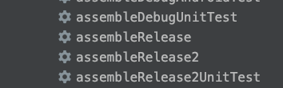
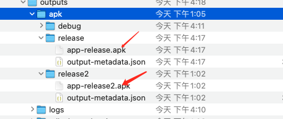

# 济康游戏开发

- 蒲公英地址 https://www.pgyer.com/TYuP
- appid: com.example.game

# 证书
- KEYSTORE_PATH=../keystore
- KEYSTORE_PASSWORD=android
- KEYSTORE_ALIAS=android
- KEYSTORE_PASSWORD_ALIAS=android

# 签名信息
MD5: 28:4B:E0:F1:C0:4E:70:9C:68:14:2A:2D:EE:34:2A:0E
SHA1: E5:E1:BF:22:00:E3:83:37:B4:8F:9D:CC:8E:C8:C7:19:A1:5C:70:6A
SHA-256: 22:B0:C4:15:6E:32:9F:37:03:2A:7E:96:30:FB:22:3C:D8:3D:32:E3:B1:47:CA:78:CA:64:A6:41:CD:51:FD:24

MD5:    284be0f1c04e709c68142a2dee342a0e
SHA1:   e5e1bf2200e38337b48f9dcc8ec8c719a15c706a
SHA-256: 22b0c4156e329f37032a7e9630fb223cd83d32e3b147ca78ca64a641cd51fd24

# 如何打包(初级/高级包)
- 在 AS 有上角找到 Tasks->Other

- 执行完毕,生成路径 jikang_game/app/build/outputs/apk, 如果 AS 没有显示,可以直接在文件目录查看

# 2021第一季度修改内容

1. 修改主题蓝色为 #2095FF
2. sharp eye '济康注意力训练, 请保持眼睛跟随小球运动' 颜色改为 333333
3. sharp eye 倒计时改为主题色
4. sharp eye 背景图标改为圆角，尺寸大小 1000dp 圆角大小 4dp
5. 1-100 全局倒计时文案改大一些
6. 1-100 按钮长度可以改小一点，文字大一点 ： 备注：所有按钮全部调大字体
7. 过目不忘顶部得分改为主题色
8. 垂直练习，速度跳转改为左右，图片颜色改为主题色。
9. 首页改版。（此次主要改动）

# 2023-03
- 升级 gradle 版本
- 升级 kotlin 版本
- 去掉济康图标和水印(WaterMarkView)

# 2023-06-28
- 舒尔特改为九宫格
